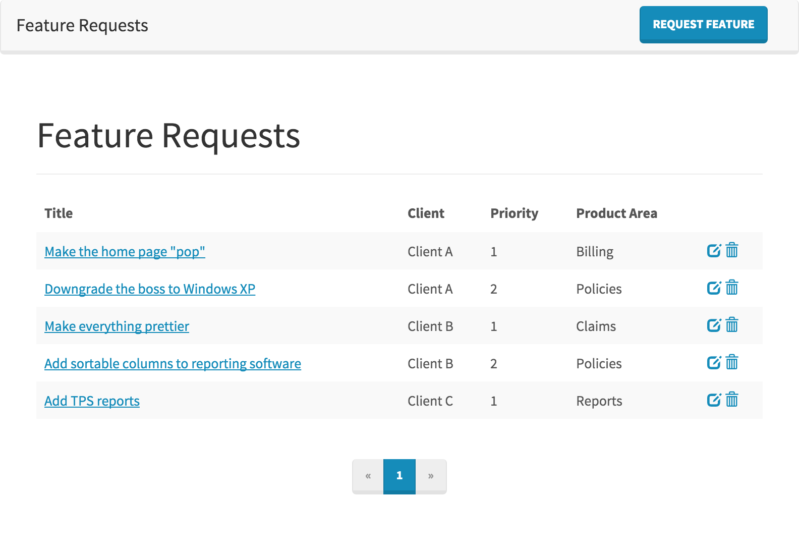
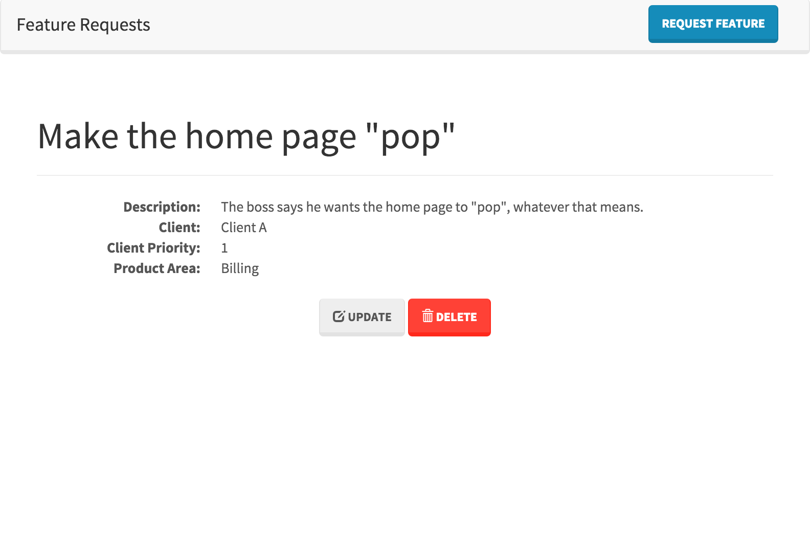
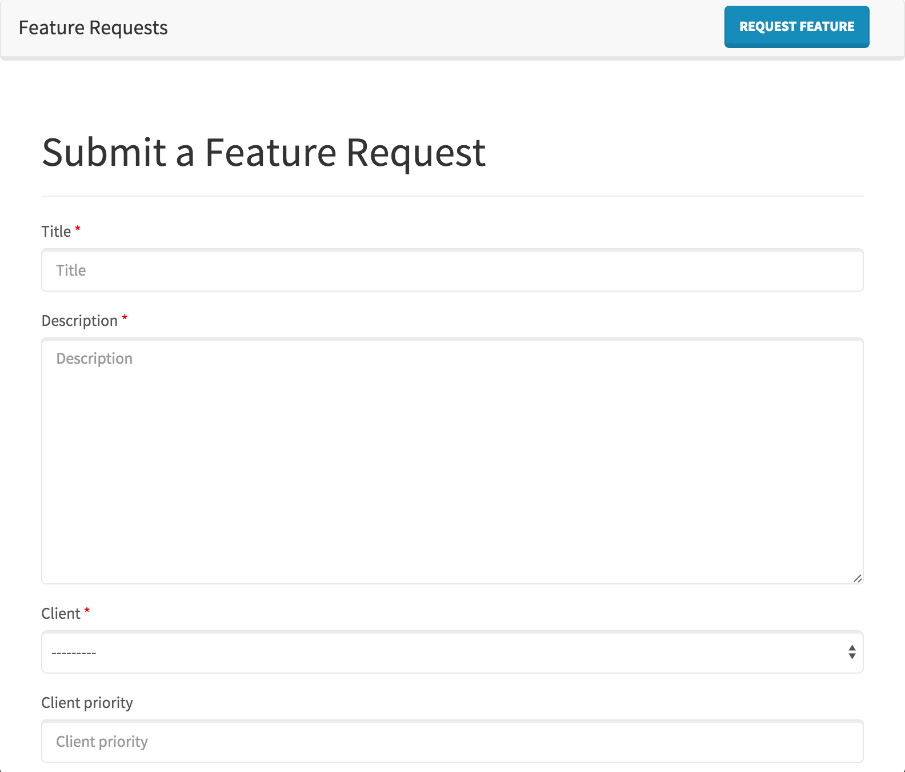

# Feature Requests

A CRUD application for managing feature requests. Uses Django 1.9 and runs on Python 2.7 or Python 3.4+.

## Features

* A full CRUD application for managing and viewing reature requests.
* Uses Django 1.9.2 and Bootstrap 3
* 100% test coverage

## Open Source

This application runs on open source software.

* **Django 1.9**
* **Bootstrap 3**
* **django-bootstrap3** — Django utilities for working with Bootstrap 3
* **django-ordered-model** — Django package for rearranging feature request's client priority
* **factory-boy** — Used to create model instances for tests
* **coverage** — Adds test coverage tracking

## Running the App

### Install Dependencies

Use `pip` to install the app's dependencies from requirements.txt:

    pip install -r requirements.txt

### Migrate the Database

Running migrations will create the SQLite database.

    python manage.py migrate

### Load Fixtures

Next, load the sample data into the database.

    python manage.py loaddata clients product_areas feature_requests

This adds 3 clients, 4 product areas, and 5 sample feature requests.

### Run the Server

Finally, run the server and navigate to http://127.0.0.1:8000/ in your browser.

    python manage.py runserver

## Running the Tests

To run the tests, first ensure that you are in the project's root directory
(the one that contains the files `manage.py`, `README.md`, and `requirements.txt`). 
Then run the following command:

    coverage run manage.py test

To view the test coverage statistics run `coverage report`.

## Screenshots

### List

### Detail

### Create

